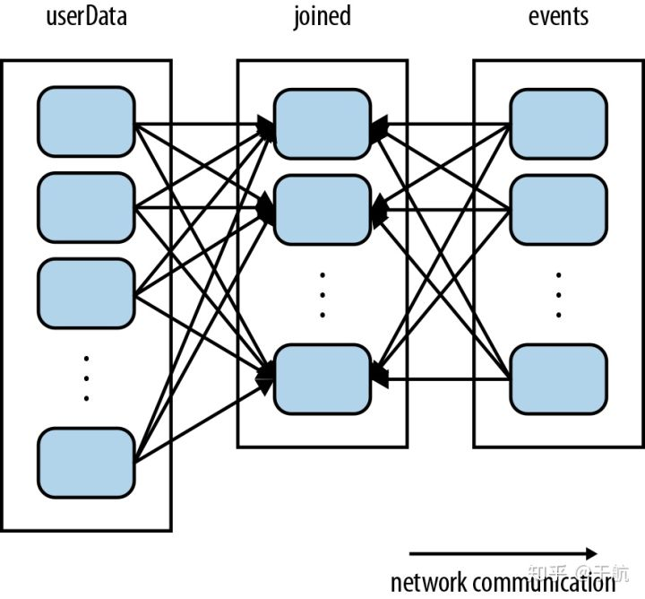
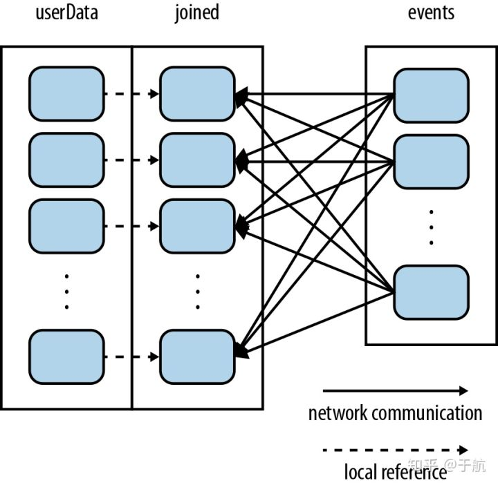
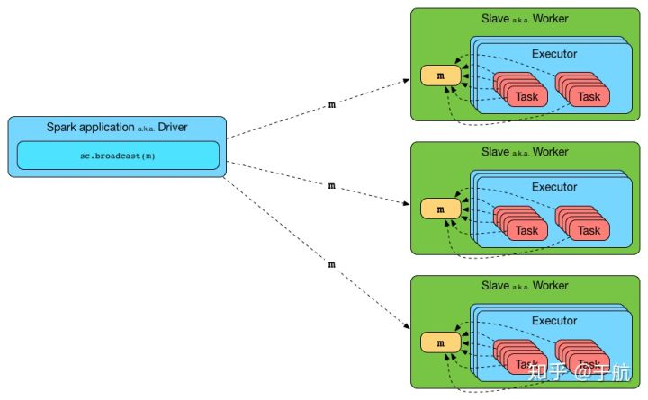

# Spark 的一些人生经验

Spark 的一些人生经验 - 于航的文章 - 知乎
https://zhuanlan.zhihu.com/p/54585684


## 闲言碎语

spark 是一种快速通用的大数据处理框架，说它快是因为它尽量将数据放到内存中计算，特别适合需要反复处理数据的迭代算法；通用是说它的 API 非常丰富，API 并不局限于 MapReduce 这种模式，可以实现各种数据处理的任务。

日常工作中经常需要用到  spark，spark 可以说是大数据处理的利器，利用 spark sql 可以方便地进行数据分析（ zeppelin作为前端）；spark  mllib 可以快速实现特征处理、模型训练；spark streaming 近实时处理数据流。

作为一名过来人，对 spark 也算有些经验，在此记录一下...

------

## 干货

###  Cluster 模式 集群资源

Spark 调优的关键在于如何充分利用集群资源以及如何减少集群内的网络开销。

1. 充分利用集群资源：以  Spark Cluster 模式启动 Application 时需要向 Yarn 申请机器资源，包括**节点数目（executor  num）**、每个**节点的核数(core num)**以及每个节点的**内存**。如果 RDD 的parition_num 远小于 excutor_num *  core_num, 那么其实某一个时刻只有 partition_num 个task在跑， 剩下的计算资源都浪费了；如果 parition_num  远大于 excutor_num * core_num 而且每个 partition 内的数据量又很小，尽管 task 跑满了，但每个 task  很快就结束了，会有很多时间花在集群的任务调度上。
2. 减少**集群内的网络开销**：对于 groupByKey, join 等 shuffle 操作，为了将相同key的数据放到同一个partition上，会导致在网络上传输大量数据。

常见的一些技巧：

### **Repartition or Coalesce after filter**

对于一个大数据集，如果 filter 只取小部分数据，可以在 filter 操作后使用 repartition /  coalesce 调整 partition 个数，使得 partition 内的数据量不宜过小，减小任务调度的代价，提高计算效率。

比如某个  HDFS 的文件总共有 100 个blocks, 一个 block 1G，spark 读进来就会有100个 partition，在经过  filter 取得想要的数据后，每个partition的数据可能就只有 1M, 假设申请的总核数 core_num =  5，那么其实大部分时间浪费在任务调度上，可以利用 repartition / coalesce 调整 partition 个数，可以设置成  core_num 的 1-3倍。

repartition 还有一个好处就是让数据**均匀分散在各个 executor** 上，**防止在 cache** 操作时某些 executor 上**缓存的数据过大造成 OO**M。

repartition 和 coalesce 稍有不同:

- coalesce：只能缩小 partition 的个数，将一个partition的数据**移动到相邻的partition**上，这样某些partition并没有数据移动，**减小了数据间的网络开销**，但partition 之间的数据量不同。
- repartition：coalesce(num,  shuffle=true)，会导致 full  shuffle,  **优势是生成的partition 的数据量基本一致。**

### **Partitioner**








对于 RDD[(K,V)] 类型的 RDD，如果需要对它进行多次 shuffle 操作(eg. join)，最好是**先对它进行 Partition** ，这样该 RDD 在后续的 join 操作中不会再发生 shuffle。

```text
val userData: RDD[(K,V)] = spark.read.textFile(xxx) // badcase
val userData: RDD[(K,V)] = spark.read.textFile(xxx).partitionBy(hashPartitioner).persist // goodcase
val events: RDD[(K,V}] = ??? // event stream
for (int i; i < t; i++) {
   userData.join(events)
   ...
}
```


### **Broadcast广播**



broadcast 机制是 driver 把数据**分发到每个 executor 上**，同一个 executor 内的 task 共享同一份数据副本。

spark  对 rdd 执行闭包（function 以及 function  引用的变量）操作时，会预先计算需要的变量以及方法。如果闭包引用了一个比较大的数据集，那么这个数据集需要由 driver 经过网络传输到每个  task 中。比如，对于一个10个结点的集群，如果数据分成了 100 个 partition（10 partitions  /node)，那么这个数组需要至少被 driver 分发100 次。

```text
val featureMap: Map[String, Int] = ??? // map feature to index
val broadcasted = sc.broadcast(featureMap)
val rdd: RDD[String] = spark.read.textFile(hdfs://...)
rdd.map(feature => featureMap.getOrElse(feature, -1)) // bad case
rdd.map(feature => broadcasted.value.getOrElse(feature, -1) //good case
```

在一个类中，如果某些字段需要传递给 executor，可以将其 broadcast 广播出去，而不是将其序列化传递到每个 task 中，序列化忽略某个字段在 scala 中可以用 transient 关键字。

```text
class HBaseContext(@transient val sc: SparkContext, 
                   @transient val config: Configuration, 
                   val tmpHdfsConfgFile: String = null)
  extends Serializable with Logging {
  @transient var credentials = SparkHadoopUtil.get.getCurrentUserCredentials()
  @transient var tmpHdfsConfiguration:Configuration = config
  @transient var appliedCredentials = false
  @transient val job = Job.getInstance(config)
  TableMapReduceUtil.initCredentials(job)
  val broadcastedConf = sc.broadcast(new SerializableWritable(config))
  val credentialsConf = sc.broadcast(new SerializableWritable(job.getCredentials))
  ....
 }
```


### **Map Side Join**

在进行 join 时，如果一个 RDD 足够小，可以直接放到 driver 的内存中，可以将此 RDD collect  到 driver 中，然后再 broadcast 到每个结点上，这样就没有 shuffle 操作。

有两种方法进行 map side join:

\1.  使用 SparkContext 的成员方法，适用于 RDD：

```text
def broadcast[T](value: T)(implicit arg0: ClassTag[T]): Broadcast[T]
```

返回的是一个 Broadcast 对象。

```text
val smallLookup = sc.broadcast(smallRDD.collect.toMap) 	
largeRDD.flatMap { case(key, value) => 
    smallLookup.value.get(key).map { otherValue => (key, (value, otherValue))   	   
}}
```

\2.  [org](https://link.zhihu.com/?target=https%3A//spark.apache.org/docs/2.1.0/api/scala/org/package.html).[apache](https://link.zhihu.com/?target=https%3A//spark.apache.org/docs/2.1.0/api/scala/org/apache/package.html).[spark](https://link.zhihu.com/?target=https%3A//spark.apache.org/docs/2.1.0/api/scala/org/apache/spark/package.html).[sql](https://link.zhihu.com/?target=https%3A//spark.apache.org/docs/2.1.0/api/scala/org/apache/spark/sql/package.html).functions，适用于 DataSet :  

```text
def broadcast[T](df: Dataset[T]): Dataset[T]
```

返回的是一个 Dataset[T]  对象

```text
// left and right are DataFrames 
left.join(broadcast(right), "joinKey")
```


编辑于 2019-02-28

