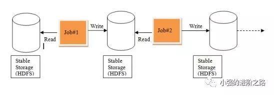
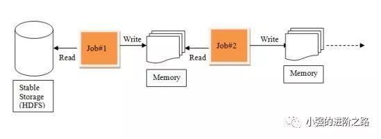
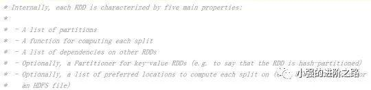
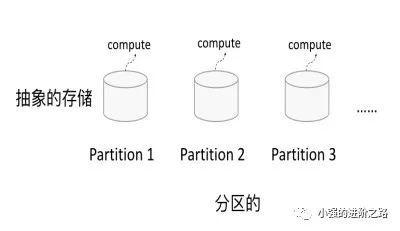
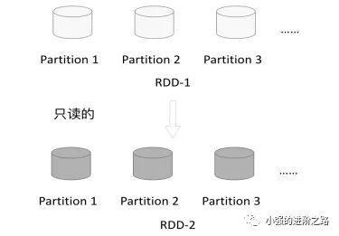
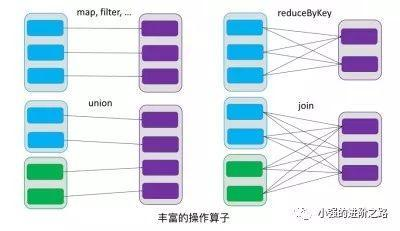
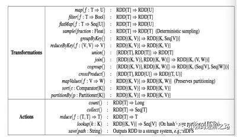
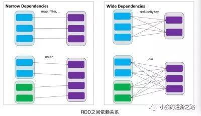
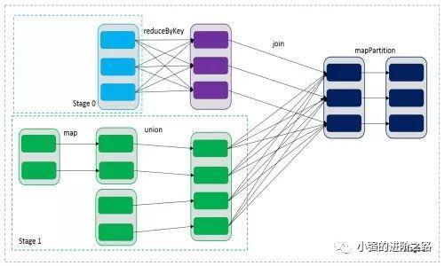
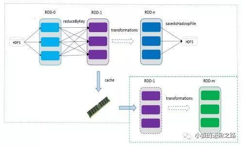

# 《从0到1学习spark》-- RDD

https://www.jianshu.com/p/59d0c55fc73d

 ](https://www.jianshu.com/u/d6709864ab05)

​             [小强的进阶之路](https://www.jianshu.com/u/d6709864ab05)                          

​                                                    0.1                                                 2019.01.14 15:03*               字数 1350             阅读 46评论 0喜欢 2

### RDD如何产生

RDD是Spark的基石，是实现Spark数据处理的核心抽象。那么RDD为什么会产生呢？

Hadoop的MapReduce是一种基于数据集的工作模式，面向数据，这种工作模式一般是**从存储**上**加载数据集**，然后**操作数据集**，最后**写入物理存储设备**。数据更多面临的是一次性处理。

MR的这种方式对数据领域两种常见的操作不是很高效。

第一种是**迭代式的算法**。比如机器学习中ALS、凸优化梯度下降等。这些都需要**基于数据集**或者**数据集的衍生数据<u>反复查询反复操作。**</u>

MR这种模式不太合适，即使多**MR串行处理**，性能和时间也是一个问题。数据的共享依赖于磁盘。另外一种是交互式数据挖掘，MR显然不擅长。

MR中的迭代：

MR迭代

Spark中的迭代：

spark迭代

我们需要一个效率非常快，且能够**支持迭代计算**和**有效数据共享的模型**，Spark应运而生。RDD是基于工作集的工作模式，更多的是面向工作流。

但是无论是MR还是RDD都应该具有类似**位置感知**、**容错**和**负载均衡等特性**。

### RDD是什么

RDD（Resilient Distributed  Dataset）叫做分布式数据集，是Spark中**最基本的数据抽象**，它代**表一个不可变、可分区、里面的元素可并行计算的集合**。在 Spark  中，对数据的所有操作不外乎创建 RDD、转化已有RDD 以及调用 RDD 操作进行求值。每个 RDD  都被分为多个分区，这些分区运行在集群中的不同节点上。RDD 可以包含 Python、Java、Scala 中任意类型的对象，  甚至可以包含用户自定义的对象。RDD具有数据流模型的特点：自动容错、位置感知性调度和可伸缩性。RDD允许用户在执行多个查询时显式地将工作集缓存在内存中，后续的查询能够重用工作集，这极大地提升了查询速度。

RDD支持两种操作:**转化**操作和**行动**操作。RDD 的转化操作是**返回一个新的 RDD的操作，比如 map()和 filter()**，而行动操作则是向驱动器程序**返回结果**或把结果**写入外部系统的操作。比如 count() 和 first()。**

Spark采用惰性计算模式，RDD只有第一次在一个行动操作中用到时，才会真正计算。Spark可以优化整个计算过程。默认情况下，Spark 的  RDD 会在你每次对它们进行行动操作时重新计算。如果想在**多个行动操作中重用同一个 RDD**，可以**使用 RDD.persist() 让 Spark  把这个 RDD 缓存下来**。

### RDD的基本属性

首先来看一下官方的描述：

官方描述

1. 一组分片（Partition），即数据集的基本组成单位。对于RDD来说，每个分片都会被一个计算任务处理，并决定并行计算的粒度。用户可以在创建RDD时指定RDD的分片个数，如果没有指定，那么就会采用默认值。默认值就是程序所分配到的CPU Core的数目。
2. 一个计算每个分区的函数。Spark中RDD的计算是以分片为单位的，每个RDD都会实现compute函数以达到这个目的。compute函数会对迭代器进行复合，不需要保存每次计算的结果。
3. RDD之间的依赖关系。RDD的每次转换都会生成一个新的RDD，所以RDD之间就会形成类似于流水线一样的前后依赖关系。在部分分区数据丢失时，Spark可以通过这个依赖关系重新计算丢失的分区数据，而不是对RDD的所有分区进行重新计算。
4. 一个Partitioner，即RDD的分片函数。当前Spark中实现了两种类型的分片函数，一个是基于哈希的HashPartitioner，另外一个是基于范围的RangePartitioner。只有对于于key-value的RDD，才会有Partitioner，非key-value的RDD的Parititioner的值是None。Partitioner函数不但决定了RDD本身的分片数量，也决定了parent  RDD Shuffle输出时的分片数量。
5. 一个列表，存储存取每个Partition的优先位置（preferred  location）。对于一个HDFS文件来说，这个列表保存的就是每个Partition所在的块的位置。按照“移动数据不如移动计算”的理念，Spark在进行任务调度的时候，会尽可能地将计算任务分配到其所要处理数据块的存储位置。

### 小结

RDD是一个应用层面的逻辑概念。一个RDD多个分片。RDD就是一个元数据记录集，记录了RDD内存所有的关系数据。
 ​

# 《从0到1学习spark》-- RDD特点精讲

https://www.jianshu.com/p/bc8650d8c59a

今天小强给大家精讲下RDD的特点，RDD表示只读的分区的数据集，对RDD进行改动，只能通过RDD的转换操作，由一个RDD得到一个新的RDD，新的RDD包含了从父RDD衍生所必需的信息。下面是RDD的特点介绍：**

### 分区

RDD逻辑上是分区的，每个分区的数据是**抽象存在的**，计算的时候会通过一个compute函数得到每个分区的数据。如果RDD是通过已有的文件系统构建，则compute函数是读取指定文件系统中的数据，如果RDD是通过其他RDD转换而来，则compute函数是**执行转换逻辑将其他RDD的数据进行转换**。

**image**

### 只读

**RDD是只读的，要想改变RDD中的数据，只能在现有的RDD基础上创建新的RDD。**

**image**

**由一个RDD转换到另一个RDD，可以通过丰富的操作算子实现，不再像MapReduce那样只能写map和reduce了**

**image**

RDD的**操作算子**包括两类，

一类叫做**转换算子transformations**，它是用来将RDD进行转化，构建RDD的血缘关系；

另一类叫做**行为算子actions**，它是用来**触发**RDD的**计算**，得到RDD的相关计算结果或者将RDD保存的文件系统中。\**\**RDD所支持的操作算子列表

**image**

### 依赖

RDDs通过操作算子进行转换，转换得到的新RDD包含了从其他RDDs衍生所必需的信息，RDDs之间维护着这种血缘关系，也称之为依赖。依赖包括两种，

一种是**窄依赖**，RDDs之间分区是**一一对应的**，

另一种是**宽依赖**，下游RDD的每个分区**与上游RDD**(也称之为**父RDD**)的每个分区都有关，**是多对多的关系**。

**image**

通过RDDs之间的这种依赖关系，一个任务流可以描述为**DAG(有向无环图)**，在实际执行过程中宽依赖对应于Shuffle(图中的reduceByKey和join)，窄依赖中的所有转换操作可以通过类似于管道的方式一气呵成执行(图中map和union可以一起执行)。

image

### 缓存

**如果在应用程序中多次使用同一个RDD，可以将该RDD缓存起来，该RDD只有在第一次计算的时候会根据血缘关系得到分区的数据，在后续其他地方用到该RDD的时候，会直接从缓存处取而不用再根据血缘关系计算，这样就加速后期的重用。如图，RDD-1经过一系列的转换后得到RDD-n并保存到hdfs，RDD-1在这一过程中会有个中间结果，如果将其缓存到内存，那么在随后的RDD-1转换到RDD-m这一过程中，就不会计算其之前的RDD-0了。**

**image**

### checkpoint

**虽然RDD的血缘关系天然地可以实现容错，当RDD的某个分区数据失败或丢失，可以通过血缘关系重建。但是对于长时间迭代型应用来说，随着迭代的进行，RDDs之间的血缘关系会越来越长，一旦在后续迭代过程中出错，则需要通过非常长的血缘关系去重建，势必影响性能。为此，RDD支持checkpoint将数据保存到持久化的存储中，这样就可以切断之前的血缘关系，因为checkpoint后的RDD不需要知道它的父RDDs了，它可以从checkpoint处拿到数据。**

### 总结

**今天这篇文章主要介绍了RDD的特点，包括分区、只读、依赖、缓存和checkpoint，想必大家应该对spark中神器RDD有个更加深入的理解，下期将介绍RDD依赖关系和DAG。希望大家有所收获，感觉不错就转发给更多的人！**